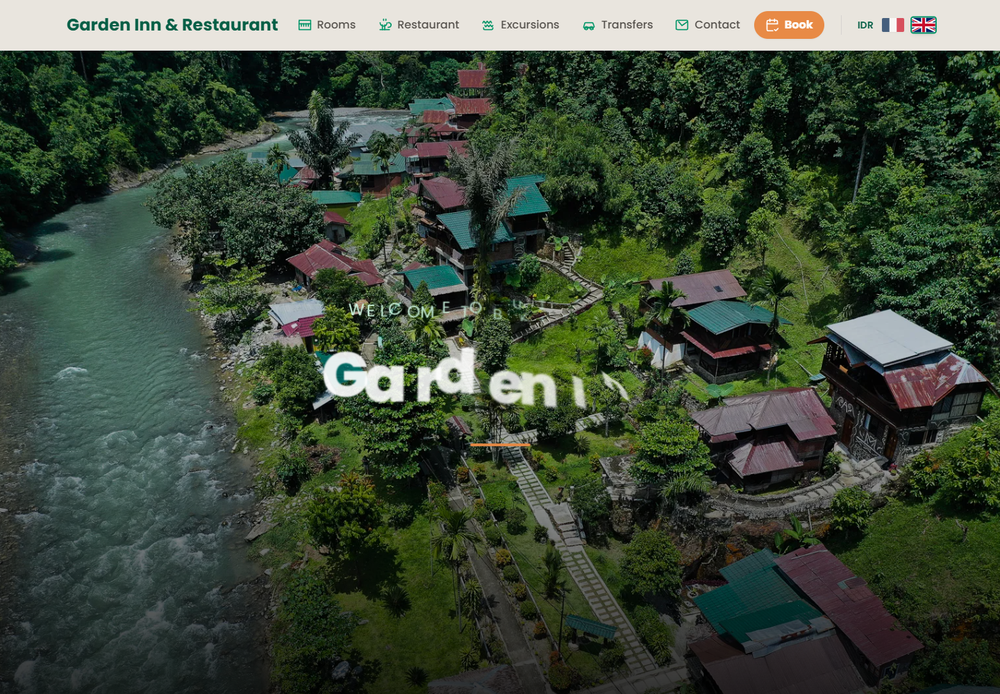
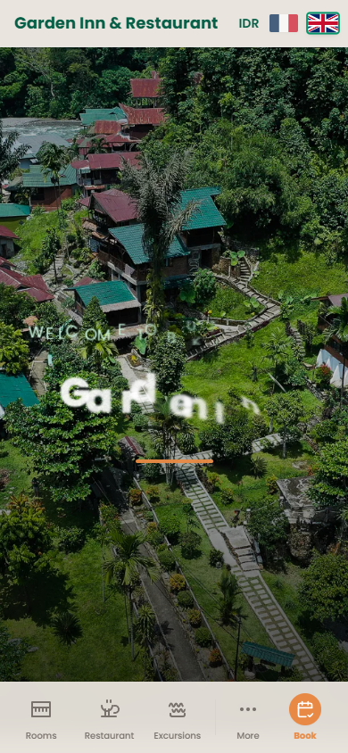

# Garden Inn

## Rapport complet

Ce depot public presente le concept, les fonctions, les choix de conception, les outils utilises, les commandes locales et les captures d'ecran de l'application. Il est genere par l'orchestrateur uniquement apres validation de publication publique.

## Concept

Site vitrine multilingue pour Bukit Lawang Garden Inn. Il presente les chambres, le restaurant, les excursions, les transferts, les packages et le contact.

Valoriser l'hebergement et orienter les visiteurs vers la reservation directe.

Public vise: Voyageurs, clients potentiels et presentation du lieu.


## Fonctionnement de l'application

L'application React affiche les sections principales et suit la section active pendant le scroll. Les donnees de chambres, excursions, transferts et packages sont traduites selon la langue choisie. Les prix en roupies peuvent etre convertis dans plusieurs devises. Les liens de reservation directe, email, itineraire Google Maps et notes Google Places guident l'utilisateur vers l'action.

## Fonctions de l'application

- Presente l'etablissement et ses offres.
- Structure les informations utiles pour les visiteurs.
- Adapte langue, devise et contenus touristiques.
- Relie le projet local a son site public.
- Presenter les chambres
- Presenter restaurant, excursions et packages
- Afficher les transferts
- Changer de langue
- Changer de devise
- Convertir les prix
- Ouvrir la reservation directe
- Creer un itineraire Google Maps
- Afficher une note Google Places avec fallback

## Actualisations et evolution

- Statut courant: SENSITIVE_BLOCKED.
- Securite: FAIL_SECRETS.
- Fonctionnement: FONCTIONNEL_AVEC_ALERTES.

## Options et conception

Le site a ete concu comme une vitrine touristique orientee reservation. Le contenu est structure par parcours visiteur: decouvrir le lieu, comprendre les offres, filtrer les transferts ou excursions, puis reserver ou contacter.

### Outils, IA et moteurs utilises

- Fichiers de traduction
- Convertisseur de devise
- Frankfurter exchange rates
- Google Maps route URL
- Google Places rating
- Lien booking direct
- Fallback image
- Navigation active au scroll
- React
- Vite
- TypeScript
- Contextes langue et devise
- Fichiers locales JSON
- Frankfurter API pour taux de change
- IntersectionObserver
- Images versionnees/cache-busting
- Liens Google Maps et booking direct

### Options techniques detectees

- Type de projet: node
- Gestionnaire: npm
- Nom package: garden-inn-app
- Version: 1.0.0
- Lien public: https://bukitlawang-garden-inn.com
- Statut securite: OK_PUBLIC

### Stack et dependances principales

- Vite/Dev server
- React
- Node.js
- Vite
- TypeScript
- Contextes langue et devise
- Fichiers locales JSON
- Frankfurter API pour taux de change
- IntersectionObserver
- Images versionnees/cache-busting
- Liens Google Maps et booking direct

### Scripts disponibles

- build: tsc && vite build
- dev: vite
- preview: vite preview

### Dependances applicatives

- react ^18.2.0
- react-dom ^18.2.0

### Dependances de developpement

- @types/node ^20.12.0
- @types/react ^18.2.66
- @types/react-dom ^18.2.22
- @vitejs/plugin-react ^4.2.1
- autoprefixer ^10.5.0
- postcss ^8.5.12
- sharp ^0.34.5
- tailwindcss ^3.4.19
- typescript ^5.2.2
- vite ^5.2.0

## Automatisations et comportements internes

- Chargement automatique des traductions avec fallback anglais
- Sauvegarde langue/devise en localStorage
- Conversion dynamique des prix IDR vers EUR/USD/GBP/AUD/SGD/CHF
- Detection de section active par IntersectionObserver
- Cache-busting des images avec APP_VERSION
- Fallback image en cas d'erreur
- Rating Google Places avec fallback
- Generation de routes Google Maps pour les transferts

## Installation locale

```powershell
npm install
```

## Lancement

```powershell
npm run dev
npm run build
```

## Captures d'ecran





## Variables d'environnement

Aucune variable d'environnement n'a ete detectee par l'orchestrateur.

## Securite

Ne jamais publier `.env`, tokens, sessions, logs sensibles, cles privees ou donnees personnelles.
