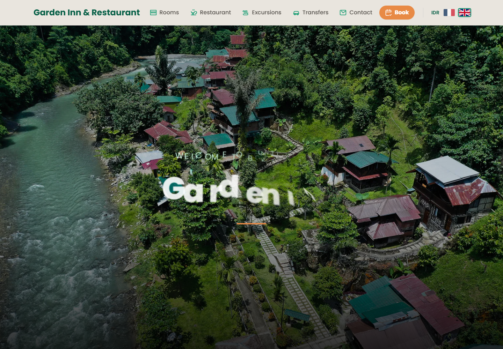
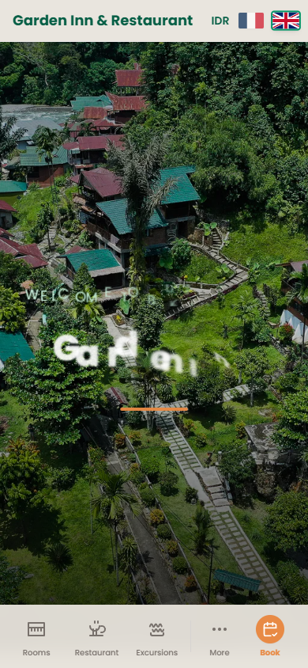

# Garden Inn

Site vitrine multilingue pour Bukit Lawang Garden Inn. Il presente les chambres, le restaurant, les excursions, les transferts, les packages et le contact.

## Objectif

Valoriser l'hebergement et orienter les visiteurs vers la reservation directe.

## Fonctions principales

- Presente l'etablissement et ses offres.
- Structure les informations utiles pour les visiteurs.
- Adapte langue, devise et contenus touristiques.
- Relie le projet local a son site public.

## Installation locale

```powershell
npm install
```

## Lancement

```powershell
npm run dev
npm run build
```

## Captures d'ecran





## Variables d'environnement

Aucune variable d'environnement n'a ete detectee par l'orchestrateur.

## Securite

Ne jamais publier `.env`, tokens, sessions, logs sensibles, cles privees ou donnees personnelles.
